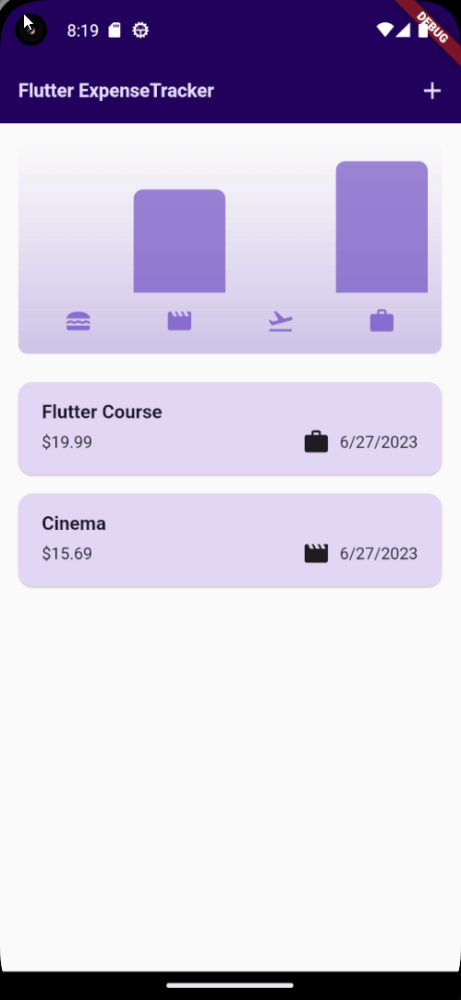

# Expense Tracker

Expense Tracker is a Flutter application that helps users track their expenses. It allows users to add, categorize, and manage their expenses, providing insights into their spending habits.

## Features

- Allows users to add and manage expenses.
- Categorizes expenses for better organization.
- Provides insights into spending habits with charts and statistics.

## Getting Started

To get started with the Expense Tracker project, follow these steps:

1. Ensure that you have Flutter installed on your machine. For more information on how to install Flutter, refer to the official Flutter documentation: https://flutter.dev/docs/get-started/install

2. Clone this repository using Git or download the project as a ZIP file.

3. Navigate to the `expense_tracker` directory.

4. Run the following command to get the required dependencies:

   `flutter pub get`

5. Connect a device or start an emulator/simulator.

6. Run the app on the device/emulator by executing the following command:

   `flutter run`

7. The Expense Tracker app should now be running on your device/emulator.

## Project Structure

The project structure of the Expense Tracker application is as follows:

- `lib`: This directory contains the main Dart code for the application.
  - `main.dart`: The entry point of the application. It sets up the Flutter app and runs it.
  - `models`: This directory contains the data models used in the app.
    - `expense.dart`: Defines the `Expense` model, representing an individual expense item.
  - `screens`: This directory contains the different screens of the app.
    - `home_screen.dart`: The home screen that displays the list of expenses and summary.
    - `add_expense_screen.dart`: The screen where users can add a new expense.
  - `widgets`: This directory contains reusable widgets used throughout the app.
    - `expense_item.dart`: Defines the `ExpenseItem` widget, representing a single expense item in the list.

## Contributing

Contributions to the Expense Tracker project are welcome! If you find a bug or have a feature request, please open an issue on the GitHub repository: https://github.com/edge33/flutter-projects/issues

If you would like to contribute code, you can fork the repository and create a pull request with your changes. Make sure to follow the existing code style and include appropriate tests for your changes.

## License

The Expense Tracker project is licensed under the MIT License. Feel free to use and modify the code as per your needs.

## Acknowledgements

- The Expense Tracker project was created by Francesco Maida.
- The project is based on the Flutter framework. For more information, visit the official Flutter website: https://flutter.dev/
