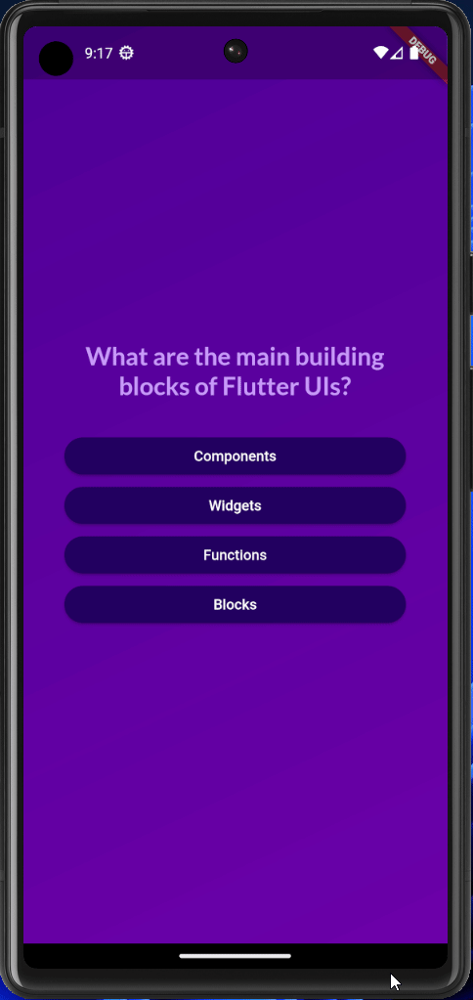

# Quiz App

Quiz App is a Flutter application that allows users to take quizzes on various topics. It provides multiple-choice questions and displays the user's score at the end of the quiz.

<p align="center">

</p>

## Features

- Offers quizzes on various topics.
- Displays multiple-choice questions.
- Tracks and shows the user's score at the end.

## Getting Started

To get started with the Quiz App project, follow these steps:

1. Ensure that you have Flutter installed on your machine. For more information on how to install Flutter, refer to the official Flutter documentation: https://flutter.dev/docs/get-started/install

2. Clone this repository using Git or download the project as a ZIP file.

3. Navigate to the `quiz_app` directory.

4. Run the following command to get the required dependencies:

```bash
flutter pub get
```

5. Connect a device or start an emulator/simulator.

6. Run the app on the device/emulator by executing the following command:

```bash
flutter run
```

7. The Quiz App should now be running on your device/emulator.

## Project Structure

The project structure of the Quiz App application is as follows:

- `lib`: This directory contains the main Dart code for the application.
  - `main.dart`: The entry point of the application. It sets up the Flutter app and runs it.
  - `models`: This directory contains the data models used in the app.
    - `question.dart`: Defines the `Question` model, representing a single question in a quiz.
  - `screens`: This directory contains the different screens of the app.
    - `home_screen.dart`: The home screen that displays the available quizzes.
    - `quiz_screen.dart`: The screen where users can take a quiz.
    - `result_screen.dart`: The screen that shows the user's score after completing a quiz.
  - `widgets`: This directory contains reusable widgets used throughout the app.
    - `custom_button.dart`: Defines a custom button widget used for navigation and interaction.

## Contributing

Contributions to the Quiz App project are welcome! If you find a bug or have a feature request, please open an issue on the GitHub repository: https://github.com/edge33/flutter-projects/issues

If you would like to contribute code, you can fork the repository and create a pull request with your changes. Make sure to follow the existing code style and include appropriate tests for your changes.

## License

The Quiz App project is licensed under the MIT License. Feel free to use and modify the code as per your needs.

## Acknowledgements

- The Quiz App project was created by Francesco Maida.
- The project is based on the Flutter framework. For more information, visit the official Flutter website: https://flutter.dev/
