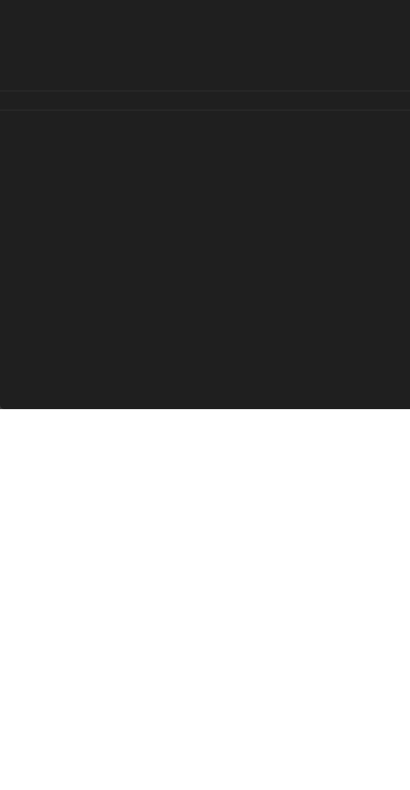

# Roll Dice

Roll Dice is a simple Flutter application that simulates rolling dice. It allows users to roll a pair of dice by tapping a button and displays the outcome of the roll on the screen.

<p align="center">

</p>

## Features

- Simulates rolling of a die.
- Displays the outcome of the roll on the screen.
- Supports both Android and iOS platforms.

## Getting Started

To get started with the Roll Dice project, follow these steps:

1. Ensure that you have Flutter installed on your machine. For more information on how to install Flutter, refer to the official [Flutter documentation](https://flutter.dev/docs/get-started/install).

2. Clone this repository using Git or download the project as a ZIP file.

```bash
git clone https://github.com/edge33/flutter-projects.git
```

3. Navigate to the `roll_dice` directory.

```bash
cd flutter-projects/roll_dice
```

4. Run the following command to get the required dependencies:

```bash
flutter pub get
```

5. Connect a device or start an emulator/simulator.

6. Run the app on the device/emulator by executing the following command:

```bash
flutter run
```

7. The Roll Dice app should now be running on your device/emulator.

## Project Structure

The project structure of the Roll Dice application is as follows:

- `lib`: This directory contains the main Dart code for the application.
- `main.dart`: The entry point of the application. It sets up the Flutter app and runs it.
- `dice.dart`: Defines the `Dice` widget, which represents a single dice.
- `dice_roller.dart`: Defines the `DiceRoller` widget, which manages the state of the dice rolls.
- `home_screen.dart`: Defines the `HomeScreen` widget, which is the main screen of the application.
- `assets`: This directory contains any static assets used in the application, such as images.

## Contributing

Contributions to the Roll Dice project are welcome! If you find a bug or have a feature request, please open an issue on the [GitHub repository](https://github.com/edge33/flutter-projects/issues).

If you would like to contribute code, you can fork the repository and create a pull request with your changes. Make sure to follow the existing code style and include appropriate tests for your changes.

## License

The Roll Dice project is licensed under the [MIT License](../LICENSE). Feel free to use and modify the code as per your needs.

## Acknowledgements

- The Roll Dice project was created by Francesco Maida.
- The project is based on the Flutter framework. For more information, visit [flutter.dev](https://flutter.dev/).
